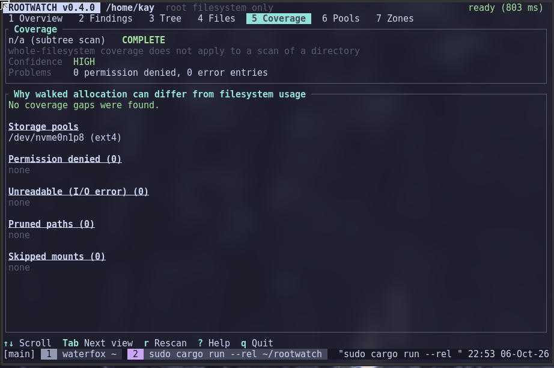

<h1>rootwatch - <a href="CHANGELOG.md">v0.4.0</a></h1>

Read-only Linux filesystem scanner with a SOC-style disk TUI.

<h1>Showcase</h1>

  
<h1>Overview</h1>

<table border="1" cellpadding="5" cellspacing="0">
  <tr>
    <th colspan="2"><code>rootwatch [OPTIONS] [PATH]</code></th>
  </tr>
  <tr>
    <td colspan="2">PATH defaults to <code>/</code></td>
  </tr>
</table>

 

<table border="1" cellpadding="5" cellspacing="0">
  <thead>
    <tr>
      <th>Option</th>
      <th>Description</th>
    </tr>
  </thead>
  <tbody>
    <tr>
      <td><code>--scope root|all|select</code></td>
      <td>which filesystems are entered (default: root)</td>
    </tr>
    <tr>
      <td><code>--include MOUNT</code></td>
      <td>enter this mountpoint too (repeatable)</td>
    </tr>
    <tr>
      <td><code>--exclude PATH</code></td>
      <td>never descend into PATH (repeatable)</td>
    </tr>
    <tr>
      <td><code>--no-prune</code></td>
      <td>do not prune /proc /sys /dev /run</td>
    </tr>
    <tr>
      <td><code>--privileged</code></td>
      <td>measure what permissions hide (re-runs via sudo)</td>
    </tr>
    <tr>
      <td><code>--elevate-with CMD</code></td>
      <td>elevation command (default: sudo)</td>
    </tr>
    <tr>
      <td><code>--nix-gc</code></td>
      <td>ask Nix for the garbage-collectable size using trusted helper paths when running as root</td>
    </tr>
    <tr>
      <td><code>--tui</code></td>
      <td>interactive terminal UI instead of the text report (see <a href="#interactive-tui---tui">Interactive TUI</a>)</td>
    </tr>
    <tr>
      <td><code>--top N</code></td>
      <td>rows per ranking in the text report</td>
    </tr>
  </tbody>
</table>

<h3>Pipeline and complexity</h3>

N = entries, D = directories, M = mounts, K = rows shown, H = depth.

<table border="1" cellpadding="5" cellspacing="0">
  <thead>
    <tr>
      <th>stage</th>
      <th>cost</th>
      <th>how</th>
    </tr>
  </thead>
  <tbody>
    <tr>
      <td>mount discovery</td>
      <td>O(M)</td>
      <td><code>/proc/self/mountinfo</code> read once</td>
    </tr>
    <tr>
      <td>traversal</td>
      <td>O(N)</td>
      <td>iterative DFS, <code>openat</code> + raw <code>getdents64</code>, O(H) open fds</td>
    </tr>
    <tr>
      <td>metadata</td>
      <td>O(N)</td>
      <td><strong>one <code>statx</code> per entry</strong>, relative to the parent dir fd (inode, blocks, mtime, uid, nlink, mount id)</td>
    </tr>
    <tr>
      <td>hard-link dedup</td>
      <td>O(1)/entry</td>
      <td>Fx-hashed <code>(dev, ino)</code> set, only for <code>nlink &gt; 1</code></td>
    </tr>
    <tr>
      <td>classification</td>
      <td>O(1)/dir</td>
      <td>component trie stepped during the DFS; no path matching afterwards</td>
    </tr>
    <tr>
      <td>aggregation</td>
      <td>O(D)</td>
      <td>arena of dir nodes, children always have larger ids than parents, one reverse pass</td>
    </tr>
    <tr>
      <td>scoring</td>
      <td>O(D)</td>
      <td>one pass; reason strings built only for retained rows</td>
    </tr>
    <tr>
      <td>ranking</td>
      <td>O(D log K)</td>
      <td>bounded min-heaps, no global sort</td>
    </tr>
    <tr>
      <td>report / TUI</td>
      <td>O(rows shown)</td>
      <td>consumes the model, never touches the filesystem</td>
    </tr>
  </tbody>
</table>

Total: <strong>O(N + D log K + M)</strong>. Paths are rebuilt (O(depth)) only for rows that are displayed.

Analysis of the tree takes 1 ms for the analysis pass and 0.13 ms for top-20 ranking in the benchmark environment. The remaining scan time is dominated by the kernel answering <code>statx</code>. Byte totals equal <code>du</code> exactly. Scanning is still single-threaded on purpose: profile first, parallelise only if benchmarks on real hardware justify it (the walker is isolated in <code>scanner.rs</code>).

<h3>Filesystem model</h3>

<ul>
  <li><code>ScanScope::Root</code> (default): only the filesystem holding the scan root; other mounts are listed with the reason they were skipped.</li>

  <li><code>ScanScope::All</code>: plus every local disk-backed or tmpfs mount. Pseudo (<code>proc</code>, <code>sysfs</code>, ...), network/FUSE, overlay and squashfs/erofs image mounts are never entered implicitly.</li>

  <li><code>ScanScope::Selected</code>: plus the mounts named with <code>--include</code>. An include forces a mount in regardless of kind, and implies its ancestor mounts.</li>

  <li>Mount identity per directory comes from <code>statx</code>'s <code>stx_mnt_id</code>, so bind mounts are detected (a bind of content that is scanned elsewhere is skipped, not double counted). <strong>Self binds</strong> - NixOS's read-only <code>/nix/store</code> - are recognised and traversed.</li>

  <li>Filesystems are grouped into <strong>storage pools</strong>. On btrfs every subvolume reports the whole pool through <code>statvfs</code>, so <code>/</code>, <code>/nix</code> and <code>/home</code> must be judged together. This is what turns "95 GiB used, 520 MiB observed" from a mystery into an explicit "these sibling mounts share the pool and were not walked".</li>
</ul>

<h3>Scan accuracy</h3>

Coverage is computed per pool. The report states a completeness level (COMPLETE ≥95%, SUBSTANTIAL ≥80%, PARTIAL ≥40%, MINIMAL), a confidence, and a list of causes for <code>used − walked</code>: skipped sibling mounts, permission-denied paths, I/O errors, pruned paths, shared extents (walked &gt; used), or unattributed metadata/snapshots/deleted-open files. Separate disks that were not scanned are listed but do not count against coverage. Subtree scans (<code>rootwatch /home/your-username</code>) are judged by errors only; whole-filesystem coverage is not applicable.

When coverage is low the report says so next to every ranking (<code>[PROVISIONAL]</code> / <code>[UNRELIABLE]</code>), findings are marked as lower bounds (<code>&gt;=</code>), and the overall verdict becomes <em>at least X</em> or <em>UNDETERMINED</em> - never "healthy".

<h3>Scoring</h3>

<table border="1" cellpadding="5" cellspacing="0">
  <thead>
    <tr>
      <th>Metric</th>
      <th>Formula / value</th>
    </tr>
  </thead>
  <tbody>
    <tr>
      <td>share</td>
      <td><code>bytes on the pool / pool used * 100</code></td>
    </tr>
    <tr>
      <td>urgency</td>
      <td><code>0.1</code> up to 50% full, linear to <code>1.0</code> at 90%, <code>1.3</code> at 100%</td>
    </tr>
    <tr>
      <td>weight</td>
      <td>path class: <code>/tmp 2.0</code>, <code>/home 1.5</code>, <code>/var 1.25</code>, generic <code>1.0</code>, <code>/nix 0.75</code>, system <code>0.5</code></td>
    </tr>
    <tr>
      <td>expected</td>
      <td><code>0.8</code> expected, <code>1.0</code> notable, <code>1.5</code> suspicious</td>
    </tr>
    <tr>
      <td>age</td>
      <td><code>1 + 0.5 * stale fraction</code> (temp, 7d) | <code>1 + 0.25 * stale fraction</code> (home, 90d)</td>
    </tr>
    <tr>
      <td>growth</td>
      <td>up to <code>+40</code> when a Baseline is supplied: <code>40 * sat(rate %/day / 5) * sat(relative growth / 2)</code></td>
    </tr>
    <tr>
      <td>score</td>
      <td><code>min(100, share * urgency * weight * expected * age + growth)</code></td>
    </tr>
    <tr>
      <td>severity</td>
      <td><code>LOW &lt; 5 &lt;= MEDIUM &lt; 15 &lt;= HIGH &lt; 35 &lt;= CRITICAL</code></td>
    </tr>
  </tbody>
</table>

Directories whose single child holds ≥90% of their bytes are pass-through containers and are not reported themselves; the frontier is. A combined <strong>risk score</strong> is a bounded noisy-OR of capacity, concentration, temporary data, growth and blind-spot components. Per-pool scores, severity counters and per-node score/severity vectors (for a tree view) are in <code>AnalysisResult</code>.

<h3>Specialised zones</h3>

<ul>
  <li><strong>Temporary data</strong> (<code>/tmp</code>, <code>/var/tmp</code>): per-zone age distribution, stale bytes (7 d / 30 d), owners, largest children and files, RAM-backed (tmpfs) detection, assessment (normal / large / stale).</li>

  <li><strong>Home</strong> (<code>/home/*</code>, <code>/root</code>, each a zone): buckets (Downloads, .cache, .local, .cargo, .config, toolchains, other hidden, other), user-owned vs root-owned vs other-owned bytes, age distribution, largest files, detected projects (git, Cargo, Node, Python, Go, Nix, JVM, CMake) and their regenerable artifact directories (<code>target</code>, <code>node_modules</code>, <code>.venv</code>, ...).</li>

  <li><strong>Nix</strong>: store size, path count, database/profile sizes, generations per profile, largest paths, largest packages with version counts, and with <code>--nix-gc</code> the garbage-collectable size from <code>nix-store --gc --print-dead</code> (falls back to <code>nix-collect-garbage --dry-run</code>). The estimate is read-only and rootwatch never runs a collection. When the process is already running as root, rootwatch resolves these helper commands only from absolute, root-owned paths whose canonical path and ancestors are not group- or other-writable; unsafe <code>PATH</code> entries are ignored.</li>
</ul>

<h3>Permissions</h3>

Rootwatch never needs root. <code>--privileged</code> re-runs the selected scan configuration as a worker via <code>sudo</code> (or <code>--elevate-with</code>) and compares: bytes and entries hidden, coverage before/after, and the denied directories with their real sizes. The elevated worker receives the scan root plus the explicit scope, include, exclude, and pruning options selected by the user; it is not a separate arbitrary filesystem-query interface.

<h3>Library layout</h3>

<code>lib.rs</code> exposes <code>scanner</code>, <code>model</code>, <code>mounts</code>, <code>zones</code>, <code>coverage</code>, <code>analysis</code>, <code>temp</code>, <code>home</code>, <code>nix</code>, <code>privilege</code>, <code>output</code>, <code>cli</code> and <code>tui</code>. The TUI consumes <code>ScanResult</code> (<code>DirectoryIndex</code> with <code>children()</code>, <code>path()</code>, <code>usage</code>) and <code>AnalysisResult</code>; nothing in the core depends on it.

<strong>Security:</strong> see <a href="SECURITY.md"><code>SECURITY.md</code></a> for the reporting process and security-sensitive behavior.

<h2>Interactive TUI (<code>--tui</code>)</h2>

<table border="1" cellpadding="5" cellspacing="0">
  <thead>
    <tr>
      <th>Command</th>
      <th>Description</th>
    </tr>
  </thead>
  <tbody>
    <tr>
      <td><code>rootwatch --tui</code></td>
      <td>scan <code>/</code> and explore</td>
    </tr>
    <tr>
      <td><code>rootwatch --tui --scope all /</code></td>
      <td>scan <code>/</code> with the same scope options as the report</td>
    </tr>
    <tr>
      <td><code>rootwatch --tui /home/your-username</code></td>
      <td>scan and explore <code>/home/your-username</code></td>
    </tr>
  </tbody>
</table>

The text report remains the default; the TUI is opt-in. The scan runs on a worker thread, so the interface stays responsive while it works and shows live counters (entries, directories, allocated bytes, current path). <code>r</code> rescans without restarting.

<h3>TUI architecture</h3>

<table border="1" cellpadding="5" cellspacing="0">
  <thead>
    <tr>
      <th>Component</th>
      <th>Role</th>
    </tr>
  </thead>
  <tbody>
    <tr>
      <td><code>CLI -> report mode -> output.rs</code></td>
      <td>text report output</td>
    </tr>
    <tr>
      <td><code>CLI -> TUI mode -> tui/</code></td>
      <td>interactive terminal UI</td>
    </tr>
    <tr>
      <td><code>event.rs</code></td>
      <td>one channel for keys, mouse, ticks and worker results</td>
    </tr>
    <tr>
      <td><code>command.rs</code></td>
      <td>raw keys -> semantic <code>Commands</code>; the only key map</td>
    </tr>
    <tr>
      <td><code>state.rs</code></td>
      <td><code>AppState</code> + per-view state; results are <code>Arc</code> and immutable</td>
    </tr>
    <tr>
      <td><code>update.rs</code></td>
      <td>events/commands -> state; pure, no I/O</td>
    </tr>
    <tr>
      <td><code>worker.rs</code></td>
      <td>scan + analysis off the UI thread</td>
    </tr>
    <tr>
      <td><code>ui.rs</code></td>
      <td>header / tabs / footer layout</td>
    </tr>
    <tr>
      <td><code>widgets/</code></td>
      <td>one render function per view, read-only</td>
    </tr>
    <tr>
      <td><code>scanner -> ScanResult -> analysis -> AnalysisResult -> tui</code></td>
      <td>data flow; the TUI never does filesystem I/O</td>
    </tr>
  </tbody>
</table>

Views (number keys jump directly): <strong>1 Overview</strong>, <strong>2 Findings</strong>, <strong>3 Tree</strong>, <strong>4 Files</strong>, <strong>5 Coverage</strong>, <strong>6 Pools</strong>, <strong>7 Zones</strong> (temporary / home / Nix).

Text captures of real renders are in <code>docs/screenshots/</code>.

<h3>Keys</h3>

<table border="1" cellpadding="5" cellspacing="0">
  <thead>
    <tr>
      <th>key</th>
      <th>action</th>
    </tr>
  </thead>
  <tbody>
    <tr>
      <td><code>j</code> <code>k</code> / <code>↑</code> <code>↓</code></td>
      <td>move selection</td>
    </tr>
    <tr>
      <td><code>h</code> <code>l</code> / <code>←</code> <code>-></code></td>
      <td>tree: collapse / expand · zones: switch type</td>
    </tr>
    <tr>
      <td><code>Enter</code></td>
      <td>open details; in tree search, show the hit in the tree</td>
    </tr>
    <tr>
      <td><code>Esc</code></td>
      <td>close details / clear filter</td>
    </tr>
    <tr>
      <td><code>Tab</code> / <code>Shift-Tab</code>, <code>1</code>-<code>7</code></td>
      <td>next / previous view, jump to a view</td>
    </tr>
    <tr>
      <td><code>g</code> <code>G</code>, <code>PgUp</code> <code>PgDn</code></td>
      <td>top / bottom, page (<code>Ctrl-u</code> / <code>Ctrl-d</code>)</td>
    </tr>
    <tr>
      <td><code>Space</code> <code>+</code> <code>-</code></td>
      <td>tree: toggle / expand / collapse</td>
    </tr>
    <tr>
      <td><code>/</code></td>
      <td>search the current view (live; <code>Enter</code> keeps, <code>Esc</code> clears)</td>
    </tr>
    <tr>
      <td><code>s</code></td>
      <td>change sort (tree: size/name; files: size/age/path)</td>
    </tr>
    <tr>
      <td><code>r</code></td>
      <td>rescan</td>
    </tr>
    <tr>
      <td><code>?</code></td>
      <td>help</td>
    </tr>
    <tr>
      <td><code>CtrL-L</code></td>
      <td>redraw</td>
    </tr>
    <tr>
      <td><code>q</code> / <code>Ctrl-C</code></td>
      <td>quit</td>
    </tr>
  </tbody>
</table>

The mouse works (wheel, click a row, click a tab) but is never required.

<h3>Reading coverage in the UI</h3>

Rootwatch compares what it walked with what the filesystem <em>says</em> is used.

The result is shown as a badge everywhere it matters:

<table border="1" cellpadding="5" cellspacing="0">
  <thead>
    <tr>
      <th>level</th>
      <th>meaning</th>
    </tr>
  </thead>
  <tbody>
    <tr>
      <td>COMPLETE</td>
      <td>&gt;= 95% of used space was seen</td>
    </tr>
    <tr>
      <td>SUBSTANTIAL</td>
      <td>&gt;= 80%</td>
    </tr>
    <tr>
      <td>PARTIAL</td>
      <td>&gt;= 40%</td>
    </tr>
    <tr>
      <td>MINIMAL</td>
      <td>&lt; 40%: rankings say little about where the space went</td>
    </tr>
  </tbody>
</table>

Anything below COMPLETE puts a banner at the top of the Overview. Rankings are marked <strong>PROVISIONAL</strong> (PARTIAL/SUBSTANTIAL) or <strong>UNRELIABLE</strong> (MINIMAL) in the text report, and sizes are shown as lower bounds (<code>≥</code>) in the TUI. The overall verdict is then "at least HIGH" or <strong>UNDETERMINED</strong> rather than "healthy". The Coverage view explains the gap: skipped sibling mounts that share a btrfs pool, permission-denied paths, pruned paths, I/O errors, shared extents. Scans of a directory (not a whole filesystem) are judged by errors only and say <code>n/a (subtree scan)</code>.

<h3>Terminal requirements</h3>

At least <strong>80x24</strong>, a UTF-8 locale and a terminal that supports the alternate screen (any modern emulator, tmux, screen). Mouse reporting is optional. Below 80x24 the UI shows "Terminal too small" instead of drawing. stdin and stdout must be a tty.

<code>--privileged</code> cannot be combined with the TUI. To run the TUI as root, invoke <code>sudo rootwatch --tui</code> directly.

<h3>Checks</h3>

<table border="1" cellpadding="5" cellspacing="0">
  <thead>
    <tr>
      <th>Command</th>
      <th>Description</th>
    </tr>
  </thead>
  <tbody>
    <tr>
      <td><code>cargo test</code></td>
      <td>unit, scanner, analysis and TUI tests</td>
    </tr>
    <tr>
      <td><code>cargo build --release &amp;&amp; python3 scripts/pty_smoke.py</code></td>
      <td>real binary on a pty</td>
    </tr>
    <tr>
      <td><code>cargo build --release --example panic_probe &amp;&amp; python3 scripts/pty_panic.py</code></td>
      <td>run the panic probe on a pty</td>
    </tr>
    <tr>
      <td><code>cargo run --release --example tui_screens -- docs/screenshots</code></td>
      <td>regenerate TUI screenshot captures</td>
    </tr>
    <tr>
      <td><code>cargo run --release --example tui_bench -- /some/big/tree</code></td>
      <td>measure per-frame TUI cost</td>
    </tr>
  </tbody>
</table>
